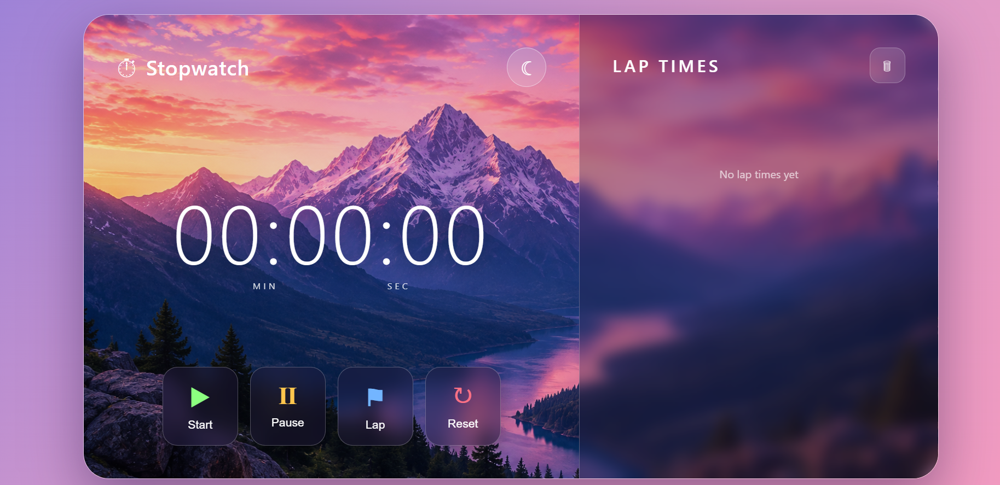

<div align="center">

# ⏱️ Stopwatch

### A Modern, Responsive Stopwatch Built with HTML, CSS & JavaScript

<br>

<a href="https://priyanka170974.github.io/StopwatchWebiste/" target="_blank">
  
</a>

<br><br>


<br><br>

**Track your time. Record your laps. Stay focused.**

</div>

---

## 📸 Project Preview

<div align="center">



<br><br>

**A clean and modern stopwatch interface with mountain-themed visuals and glassmorphism design.**

</div>

---

## 📌 About the Project

**Stopwatch** is a modern and responsive web application built using
**HTML, CSS and JavaScript**.

It provides a simple and interactive way to measure time with essential
stopwatch controls such as **Start, Pause, Lap and Reset**.

The project features a beautiful **mountain-themed background**, a
glassmorphism-inspired interface, smooth interactions and a **Dark Mode**
for a comfortable viewing experience.

The main goal of this project is to combine **useful functionality with
a clean and visually appealing user interface**.

---

## ✨ Features

### ⏱️ Stopwatch Controls

- ▶️ **Start** — Start the stopwatch and begin tracking time.
- ⏸️ **Pause** — Pause the stopwatch without losing the current time.
- 🏁 **Lap** — Record the current stopwatch time.
- 🔄 **Reset** — Reset the stopwatch and lap history.
- 🗑️ **Clear Laps** — Remove all recorded lap times.

### 🌙 Dark Mode

Switch between the normal and dark visual experience using the
moon button in the top-right corner.

### 🏁 Lap Tracking

Record multiple laps while the stopwatch continues running.
Each lap is displayed separately with its recorded time.

### 🏔️ Mountain-Themed Interface

A scenic mountain background combined with transparent glass-style
panels creates a clean and relaxing visual experience.

### 📱 Responsive Design

The interface adapts to different screen sizes including:

- 💻 Desktop
- 💻 Laptop
- 📱 Mobile
- 📟 Tablet

---

## 🎨 Design

The project uses a modern visual style based on:

- 💎 Glassmorphism
- 🌄 Scenic mountain background
- 🔲 Rounded cards
- ✨ Soft shadows
- 🪟 Transparent panels
- 🎯 Minimal and clean layout
- 🖱️ Smooth hover interactions

The design focuses on keeping the stopwatch **simple, readable and easy
to use** while maintaining a polished appearance.

---

## 🛠️ Technologies Used

| Technology | Purpose |
|------------|---------|
| **HTML5** | Structure and content |
| **CSS3** | Styling, layout and responsive design |
| **JavaScript** | Stopwatch logic and interactions |

---

## ⚙️ How It Works

The stopwatch uses JavaScript timer functionality to continuously
update the displayed time.

### Timer Flow

```text
Start
  ↓
Timer Running
  ↓
Lap ───→ Save Current Time
  ↓
Pause
  ↓
Reset
